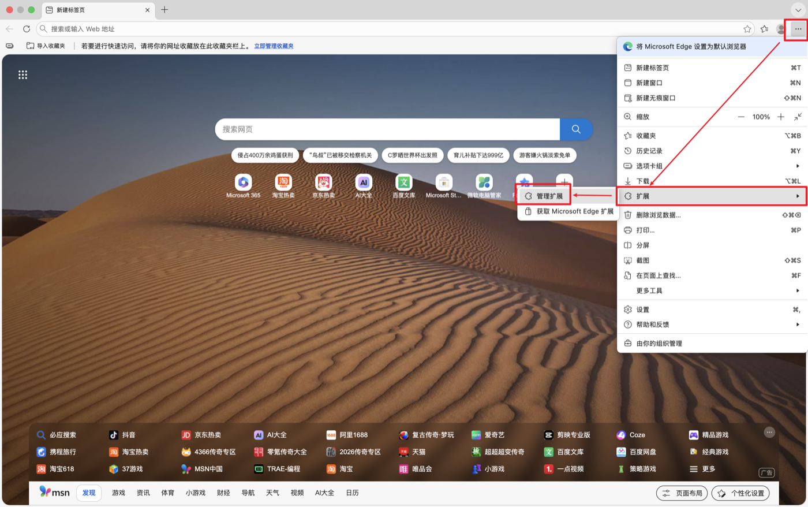
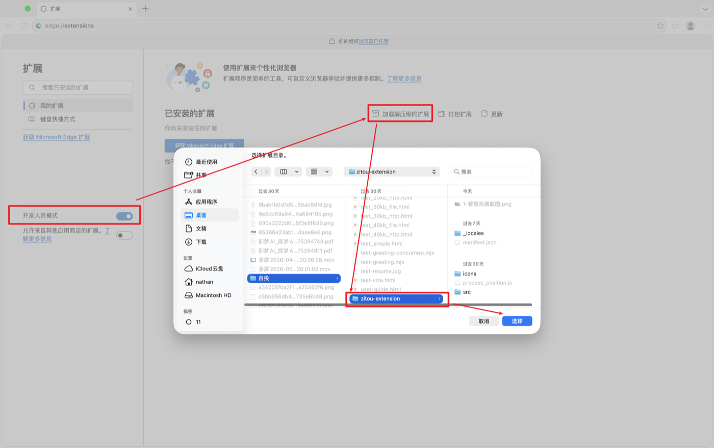
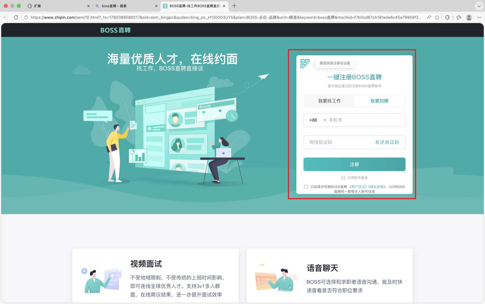
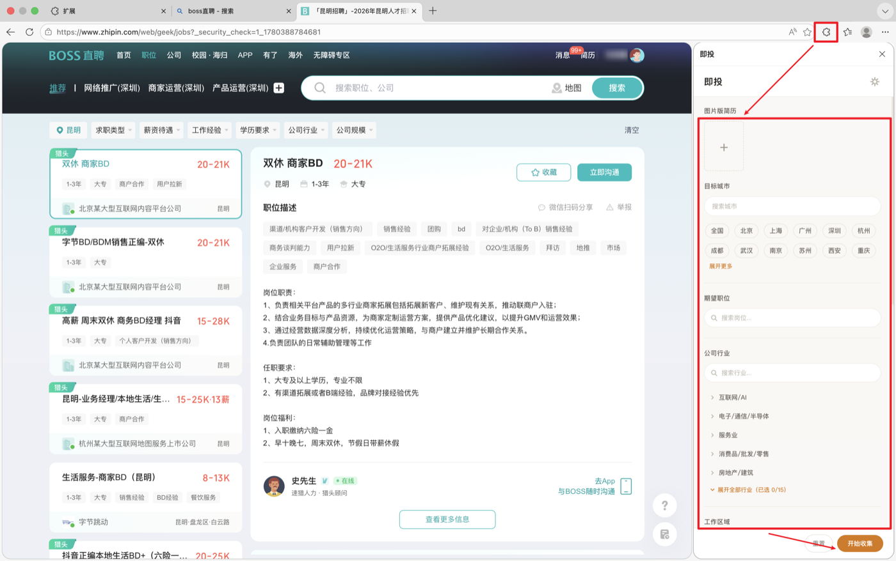
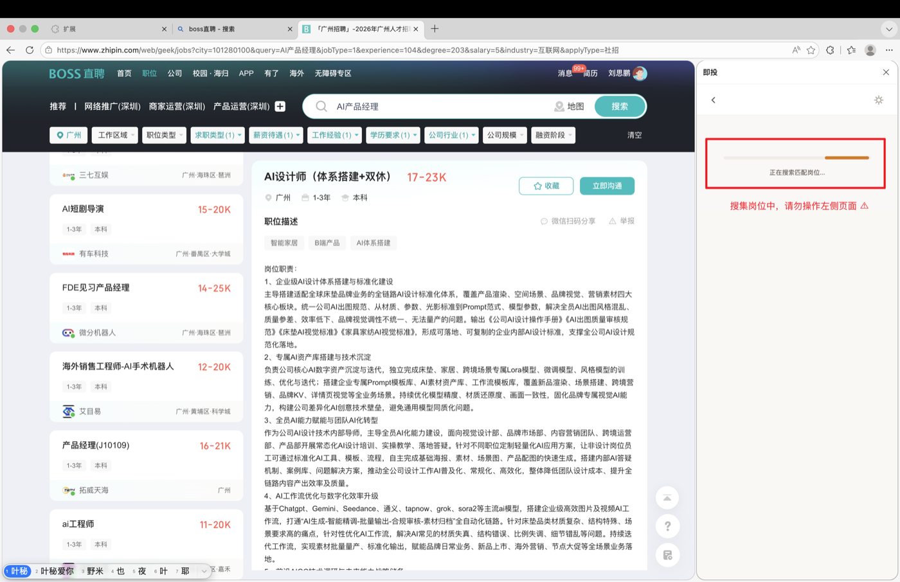
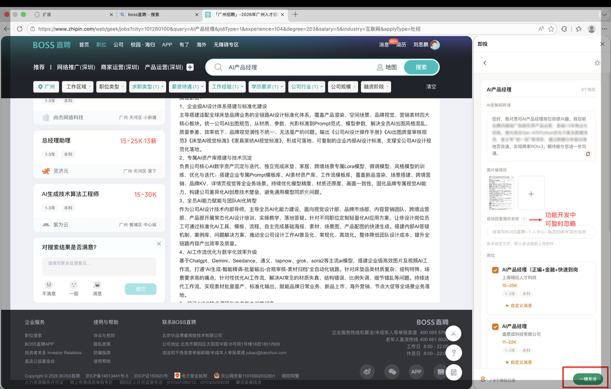
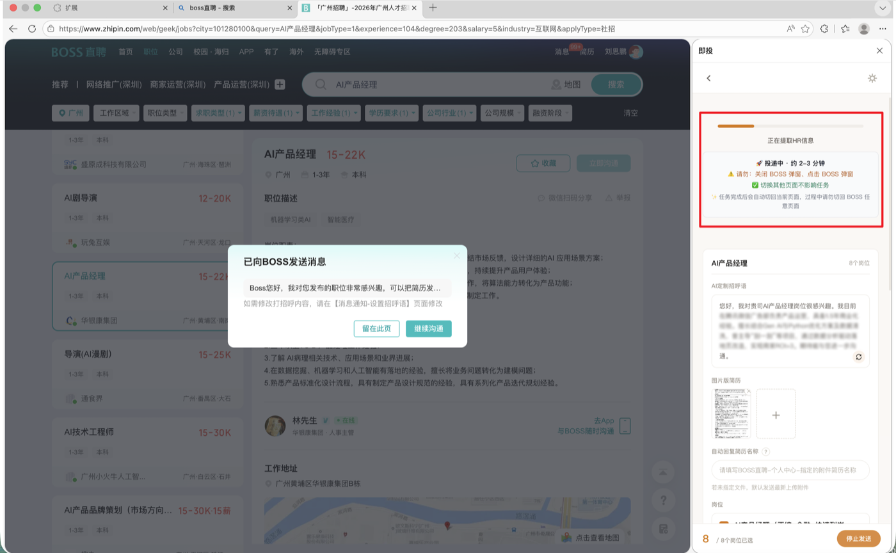
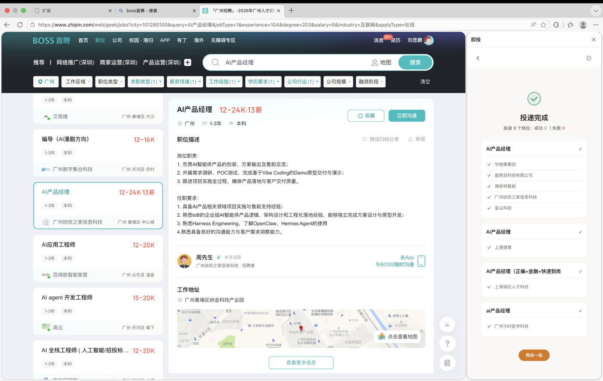
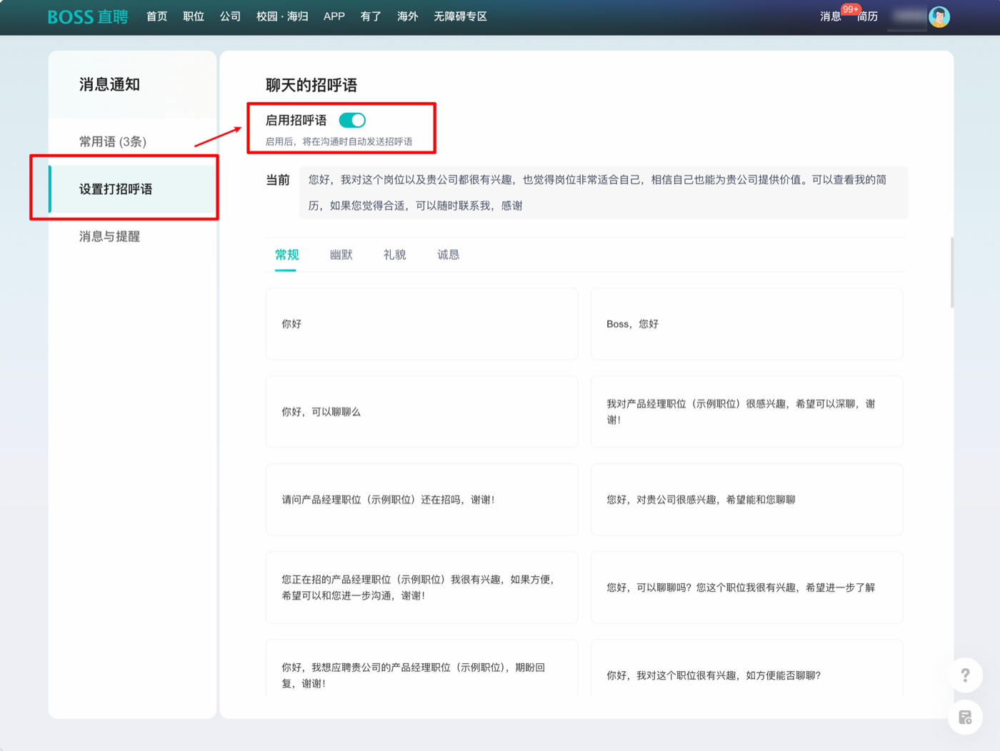

# 即投 · jitou

> BOSS 直聘 AI 自动投递助手 —— 一键海投，智能招呼语

即投帮你在 BOSS 直聘上批量投递岗位，并用 AI 读取你的简历自动生成招呼语，连同简历一起发给 HR。海投的重复操作交给它，你只管面试。

---

## 安装

下载 [Releases](../../releases) 里的 `jitou-v1.0.1.zip` → 解压 → 用开发者模式加载。

<table>
<tr>
<td width="50%"> <b>①</b> 浏览器菜单 → 扩展 → 管理扩展</td>
<td width="50%"> <b>②</b> 开启「开发人员模式」→「加载解压缩的扩展」→ 选解压出的文件夹</td>
</tr>
</table>

> 解压出的文件夹**别删、别挪**，扩展要一直读它。支持 Edge / Chrome / 360 / QQ 等 Chromium 浏览器。

---

## 怎么用

<table>
<tr>
<td width="33%"> <b>①</b> 登录 BOSS 直聘</td>
<td width="33%"> <b>②</b> 传简历、选城市与期望岗位</td>
<td width="33%"> <b>③</b> 自动搜集匹配岗位</td>
</tr>
<tr>
<td width="33%"> <b>④</b> AI 生成招呼语，确认</td>
<td width="33%"> <b>⑤</b> 一键批量投递</td>
<td width="33%"> <b>⑥</b> 投递完成</td>
</tr>
</table>

---

## 使用须知

**① 先打开 BOSS 的「启用招呼语」开关 ⚠️ 重要**

投递前请确认 BOSS 直聘已开启招呼语功能：`消息通知 → 设置打招呼语 → 启用招呼语`（默认是开的）。
若关掉了它，点「立即沟通」会直接跳转聊天页，导致即投卡在「正在提取 HR 信息」无法继续。投不出去时，先来这里检查。

 开关位置：左侧「设置打招呼语」→「启用招呼语」打开（绿色）

**② 一批别投太多，几十个就好**

筛选条件太宽时，一次可能搜出一两百个岗位。建议**单批次投几十个**，分多次跑，更稳更不易出错。条件太糙时也建议收窄期望岗位/城市，匹配更准。

---

## 隐私

只在 BOSS 直聘（`*.zhipin.com`）运行，不碰其他网站；简历等数据存在你浏览器本地。生成招呼语时，简历内容会发给阿里云通义千问 AI（详见[隐私政策](https://jitou-privacy.netlify.app/privacy-policy.html)）。

## 反馈

有问题或建议，欢迎到 [Issues](../../issues) 提；也可以扫码进用户群，实时交流、反馈 bug。早期版本，你的反馈直接影响迭代 🙌

 微信扫码进「即投 · 用户沟通群」

> 二维码过期了？到 [Issues](../../issues) 留言或备注，我会更新。
